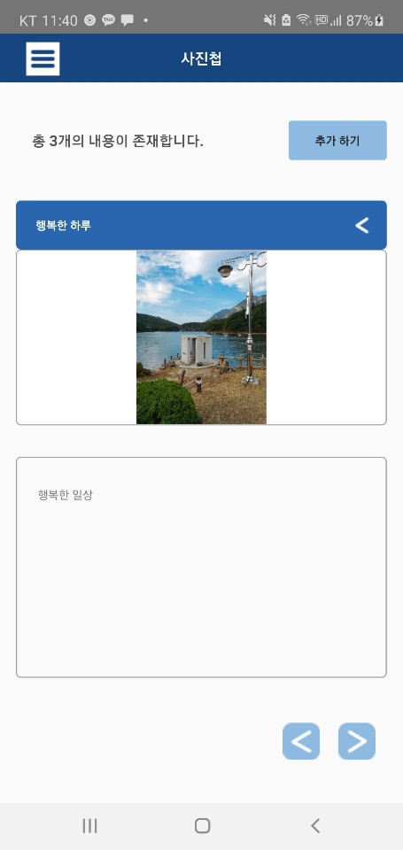

# D_Card
2020 ICT_Complex Develop Challenge App Project

 
 

### 0. 프로젝트 스킬

- React Native
- TypeScript

### 1. 프로젝트 계획 이유

- 경증 치매환자들이 사회에서 일반적으로 생활을 도와주기 위해서 만든 앱,
- 제 3자가 치매환자들을 돌볼 때, 기재된 치매환자들의 병명, 인적사항, 사진, 긴급 연락처를 통해서 위험한 상황이나 알아야될 사항을 얻을 수 있음

 
 

### 2. 프로젝트 기능
- App Info Page

  > 앱에 대한 소개 페이지

- User Instruction Page

  > 치매 환자들의 사진 및 인적 사항을 추가 및 수정할 수 있음

- User Photo Page

  > 치매 환자들의 일상 및 추억의 사진을 등록, 수정, 삭제를 할 수 있음

- User Emergecy call Book Page

  > 치매 환자들이 긴급한 상황을 대비해 비상 연락망을 등록, 수정, 삭제를 할 수 있음
  
- User Health Info Page

  > 치매 환자들이 건강 및 약 정보를 등록, 수정, 삭제를 할 수 있음

 
 

### 3. 프로젝트 화면

#### Home 화면

 

#### Instruction 화면

 

#### Photo 화면

 

#### Health 화면

 

#### Emergency 화면

 

